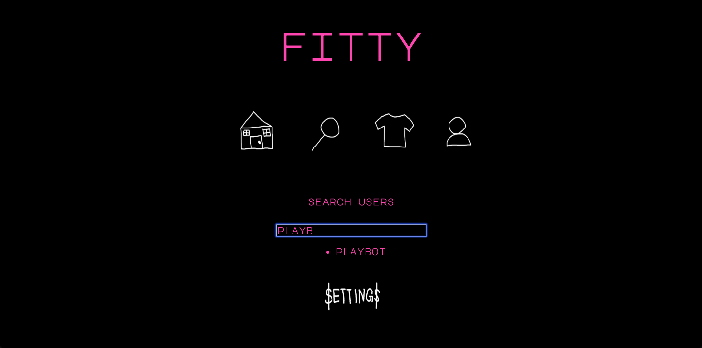

# FITTY

WELCOME TO THE FITTY APP 

A SOCIAL MEDIA APP FOR PEOPLE WHO ENJOY FASHION / STREETWEAR CULTURE. 

THIS APP WAS CREATED USING HTML, CSS, JAVASCRIPT, NODEJS &EXPRESS.

![PROFILE PAGE SCREENSHOT]
(public/images/readme-screenshot-2.png)

UNSOLVED PROBLEMS / INCOMING FEATURES :

- ABILITY TO SELL / PURCHASE PRODUCTS
- ABILITY TO FOLLOW / UNFOLLOW USERS
- ABILITY TO LIKE / DISLIKE USERS' POSTS
- ABILITY TO UPLOAD IMAGES DIRECTLY TO THE SITE, INSTEAD OF HAVING TO USE A URL

EARLY APP / DESIGN CONCEPT :

![WIREFRAME FOR NAV BAR]
(public/images/wire-frames-1.png)

![WIREFRAME 3JS]
(public/images/wire-frames-3.png)

![WIREFRAME 3JS PT2]
(public/images/wire-frames-4.png)

CONTACT : 

UMMERNKHAN@GMAIL.COM

